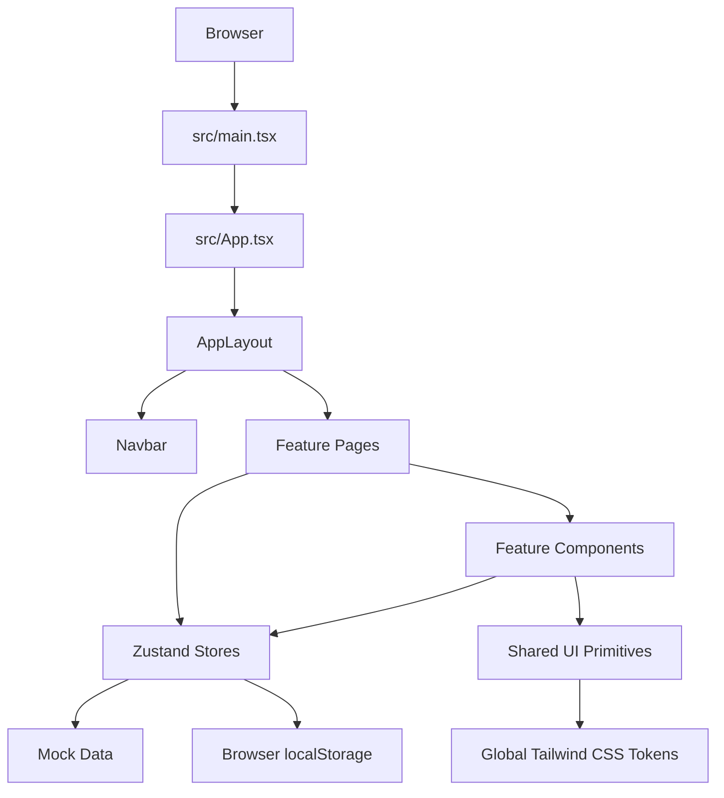

# MediBook

MediBook is a patient-focused healthcare access platform prototype. It brings doctor discovery, appointment booking, patient records, prescriptions, family healthcare management, diagnostics, telehealth, live chamber queues, insurance workflows, and emergency support into one responsive web application.

The project is built as a client-side React and TypeScript application with Vite. It uses realistic mock data and browser storage to demonstrate complete patient journeys without requiring a backend service.

## Who This Site Is For

### Patients and families

MediBook is designed for people who need to:

- Find a doctor by specialty, location, rating, experience, fee, or availability.
- Compare doctor profiles before making a healthcare decision.
- Book appointments for themselves or a family member.
- Choose an in-person or telehealth consultation where available.
- Keep track of upcoming, completed, cancelled, and rescheduled visits.
- Read prescriptions, track medicine intake, and order prescribed medicines.
- Store healthcare information for children, parents, spouses, and other dependants.
- View health records and access supporting healthcare services.
- Check live chamber queues before visiting a clinic.
- Start emergency workflows such as ambulance booking, blood donor search, and ICU availability lookup.

### Older adults and caregivers

The interface is designed for high clarity and low cognitive load. Large readable text, direct labels, visible status information, familiar icons, keyboard focus states, responsive layouts, and clear primary actions support patients who may be older, unwell, stressed, or using the site on a mobile device.

### Clinics and healthcare service operators

The current application is primarily a patient experience prototype. Its data model also demonstrates the information a future clinic or operations portal would need: doctor schedules, time slots, appointment statuses, patient details, clinic locations, prescriptions, queue data, ambulance requests, donors, and hospital capacity.

## Product Goals

MediBook is built around five goals:

1. **Reduce friction:** Move from doctor search to confirmed appointment through a short, understandable flow.
2. **Improve trust:** Show qualifications, verification, reviews, ratings, experience, fees, languages, clinic details, and availability before booking.
3. **Support the whole care journey:** Continue after booking with prescriptions, medication tracking, follow-up information, and pharmacy ordering.
4. **Support families:** Let one account manage multiple patient profiles and select the correct patient during healthcare workflows.
5. **Make urgent information discoverable:** Keep emergency support visible but clearly separated from routine booking.

## How It Works

### 1. Start from the home page

The home page provides the primary patient entry point. Search by doctor, condition, or clinic, then narrow results by specialty and city. Popular specialty shortcuts open filtered results.

The home page also links to emergency and ambulance support, live video consultation, health records, laboratory tests, chamber queue tracking, family profiles, and prescriptions.

### 2. Search and compare doctors

The search experience uses the doctor data in `src/data/mockDoctors.ts` and filter state in `src/stores/useSearchStore.ts`.

Available capabilities include free-text search, specialty, location, availability date, fee range, minimum rating, minimum experience, telehealth-only availability, new-patient availability, available-today filtering, and sorting by recommendation, rating, experience, fee, name, or availability.

Doctor profiles can show the doctor name, title, specialty, avatar, verification, rating, reviews, experience, consultation fee, education, qualifications, languages, hospital affiliation, new-patient status, telehealth status, clinic details, and schedule configuration.

### 3. Review a doctor profile

The doctor profile combines the doctor header, overview, reviews, clinic location, available services, schedule, and booking sidebar. Patients can save or unsave doctors. Saved doctor IDs are managed by the UI store for the current browser session.

### 4. Complete the four-step booking flow

The booking flow is managed by `src/stores/useBookingStore.ts`:

1. **Date and time:** Choose a date and available slot in the selected timezone.
2. **Patient information:** Confirm patient identity, contact details, reason for visit, notes, gender, insurance, and guardian details when applicable.
3. **Review and payment:** Review doctor, patient, date, time, visit type, fee, discount, and payment option. Demo promo codes are `HEALTH10`, `FIRSTVISIT`, `WELLNESS50`, and `TELEHEALTH20`.
4. **Confirmation:** View the created appointment and next available actions.

The default patient details are demonstration data. A production version must load authenticated patient information from a secure API and must never expose real personal information in source code.

### 5. Manage appointments

The appointments page supports upcoming, completed, and cancelled visits; appointment detail viewing; cancellation with a reason; rescheduling; reschedule history; and telehealth entry where available.

Appointments are handled by `src/stores/useAppointmentStore.ts` and persisted in browser `localStorage` under `medibook_appointments_v1`.

### 6. Continue care after the visit

The prescriptions area supports prescription search and specialty filtering, prescription details, diagnosis, medicine dosage and instructions, follow-up dates, medicine intake tracking by date and time of day, pharmacy order creation, order status, and estimated delivery information.

Prescription data, intake logs, and pharmacy orders are persisted locally by `usePrescriptionStore`.

### 7. Manage family healthcare

Family profiles support self, spouse, parent, and child records. A profile can contain relationship, age, gender, blood group, allergies, chronic conditions, contact details, emergency contact, active prescriptions, and upcoming appointment counts.

The active patient can be changed from the navigation profile switcher. Family profile state uses Zustand persistence with the `healthcare_family_profiles_v10` storage key.

### 8. Use additional healthcare services

- **Health records:** Personal healthcare information and clinical record views.
- **Lab tests:** Diagnostic test discovery and booking-oriented flows.
- **Chamber queue tracker:** Live outpatient serial and queue tracking.
- **Insurance claims:** Insurance coverage and claim workflow views.
- **Telehealth:** A consultation room interface for a target appointment.
- **Emergency hub:** Ambulance requests, blood donor registration and availability, and hospital ICU information.

These workflows use local state and mock data. They are not connected to real hospitals, ambulances, laboratories, pharmacies, payment processors, or clinical systems.

## Main Routes

| Route                      | Purpose                                            |
| -------------------------- | -------------------------------------------------- |
| `/`                        | Home page and doctor search entry point            |
| `/search`                  | Search, filter, sort, and compare doctors          |
| `/doctors/:id`             | Doctor profile, reviews, clinic, and booking entry |
| `/book`                    | General booking flow                               |
| `/book/:id`                | Booking flow for a selected doctor                 |
| `/appointments`            | Appointment management                             |
| `/dashboard/appointments`  | Appointment management alias                       |
| `/prescriptions`           | Prescription management                            |
| `/dashboard/prescriptions` | Prescription management alias                      |
| `/telehealth`              | Telehealth consultation room                       |
| `/emergency`               | Emergency support hub                              |
| `/health-records`          | Health records                                     |
| `/lab-tests`               | Diagnostic laboratory tests                        |
| `/chamber-tracker`         | Live chamber queue tracking                        |
| `/family-profiles`         | Family member profiles                             |
| `/insurance`               | Insurance claims and coverage                      |

Navigation is handled in application state by `useUIStore`. This prototype does not use a browser router; route objects are stored in Zustand and rendered by the switch in `src/App.tsx`.

## Functionality Summary

| Area                     | Implemented behavior                                                                                  |
| ------------------------ | ----------------------------------------------------------------------------------------------------- |
| Doctor discovery         | Search, filters, sorting, pagination, doctor cards, favorites                                         |
| Doctor information       | Qualifications, reviews, schedule, clinic, fee, telehealth status                                     |
| Booking                  | Four-step flow, time slot selection, patient details, promo codes, payment choice, confirmation       |
| Appointments             | Create, list, inspect, cancel, reschedule, status tabs, reschedule history                            |
| Prescriptions            | Search, filter, details, medicine schedule tracking, pharmacy order creation                          |
| Family care              | Add, edit, remove, and switch patient profiles                                                        |
| Health services          | Records, labs, queue tracking, insurance, telehealth, emergency workflows                             |
| Feedback                 | Toast notifications for user actions                                                                  |
| Preferences              | Timezone selection and mobile navigation state                                                        |
| Persistence              | Local browser storage for appointments, prescriptions, medicine tracking, orders, and family profiles |
| Accessibility foundation | Semantic controls, visible focus, readable type, reduced-motion support, labeled forms                |

## System Architecture



### Application entry and shell

- `src/main.tsx` creates the React root, enables `StrictMode`, and loads global styles.
- `src/App.tsx` reads the current route from `useUIStore`, selects the matching page, and applies lightweight page transitions with Motion.
- `src/components/layout/AppLayout.tsx` provides the persistent navbar, page region, footer, and toast container.
- `src/components/layout/Navbar.tsx` provides desktop and mobile navigation, service links, timezone selection, appointment count, and active family profile switching.

### Pages and feature components

Pages in `src/pages/` represent full-screen workflows. Feature components are grouped by domain under `src/components/appointments`, `booking`, `doctor`, `home`, `prescriptions`, `search`, and `telehealth`. Shared layout and interface primitives live under `src/components/layout` and `src/components/ui`.

### State management

Zustand stores in `src/stores/` provide centralized client state:

- `useUIStore`: route, timezone, mobile menu, toasts, saved doctors.
- `useSearchStore`: search fields, filters, sorting, and pagination.
- `useBookingStore`: selected doctor, date, slot, patient details, promo, step, and confirmation.
- `useAppointmentStore`: appointment creation, cancellation, rescheduling, and persistence.
- `usePrescriptionStore`: prescriptions, medicine intake, pharmacy orders, and persistence.
- `useFamilyProfilesStore`: family profiles, active patient, and persistence.
- `useChamberQueueStore`, `useEmergencyStore`, `useHealthRecordsStore`, `useInsuranceStore`, `useLabTestsStore`, and `useWaitlistStore`: domain-specific healthcare workflows.

### Types and utilities

`src/types/` contains shared models such as `Doctor`, `Clinic`, `Appointment`, `Prescription`, `TimeSlot`, `PatientDetails`, and route types. `src/data/` contains mock doctors, reviews, clinics, and prescriptions. `src/utils/` contains calendar, scheduling, and specialty icon helpers. `src/hooks/` contains reusable hooks such as debounced search behavior.

### Styling and design system

Tailwind CSS is integrated through Vite. Global tokens and base styles live in `src/index.css`. The visual direction is a light, minimal healthcare interface with Atkinson Hyperlegible typography, calm cyan and teal accents, high-contrast text, moderate spacing, simple borders, restrained shadows, visible keyboard focus, and reduced-motion handling.

## Technology Stack

- React 19
- TypeScript 5.8
- Vite 6
- Tailwind CSS 4
- Zustand 5
- Motion for React
- Lucide React
- React Hook Form and Zod
- date-fns
- Browser `localStorage` for prototype persistence

## Getting Started

### Prerequisites

- Node.js 18 or newer recommended.
- npm 9 or newer recommended.

### Install and run

```bash
npm install
npm run dev
```

Vite serves the app at `http://localhost:3000`.

### Validate and preview

```bash
npm run lint
npm run build
npm run preview
```

The `lint` script currently runs `tsc --noEmit`, so it checks TypeScript correctness rather than running a separate ESLint configuration.

## Prototype Data and Persistence

MediBook currently runs without a backend. Initial doctors, reviews, clinics, prescriptions, appointments, donors, hospitals, and family profiles are defined under `src/data/` and `src/stores/`.

Persisted browser keys include:

- `medibook_appointments_v1`
- `medibook_prescriptions_v1`
- `medibook_med_tracker_v1`
- `medibook_pharmacy_orders_v1`
- `healthcare_family_profiles_v10`

To reset the prototype, clear the site data for `localhost:3000` in browser developer tools.

## Important Production Considerations

This repository demonstrates a healthcare UX and front-end flow. It is not a production clinical system. Before production use, it would need:

- Authentication, authorization, and role-based access control.
- A secure backend and database for patient, appointment, prescription, and billing data.
- Encryption in transit and at rest.
- Audit logs for protected health information access.
- Consent, privacy, retention, and data deletion workflows.
- Server-side appointment locking to prevent double booking.
- Verified provider, clinic, laboratory, ambulance, pharmacy, and hospital integrations.
- Secure payment and refund processing.
- Real notifications for appointment reminders and queue updates.
- Clinical review of medical copy and emergency instructions.
- Accessibility testing with screen readers, keyboard-only navigation, zoom, contrast tools, and mobile assistive technologies.
- Regional legal and regulatory review before handling real patient data.

Never place real patient information, production credentials, API keys, or payment details in mock data or client-side source files.

## Project Structure

```text
medibook/
|-- assets/                     Static assets
|-- src/
|   |-- App.tsx                 Route-to-page composition
|   |-- index.css               Global styles and design tokens
|   |-- main.tsx                React entry point
|   |-- components/             Layout, UI, and feature components
|   |-- data/                   Mock doctors and prescriptions
|   |-- hooks/                  Reusable React hooks
|   |-- lib/                    Shared helpers
|   |-- pages/                  Full product workflows
|   |-- stores/                 Zustand state modules
|   |-- types/                  Shared TypeScript domain types
|   `-- utils/                  Scheduling and display helpers
|-- index.html
|-- metadata.json
|-- package.json
|-- tsconfig.json
`-- vite.config.ts
```

## Development Guidelines

1. Keep healthcare actions explicit and easy to reverse.
2. Preserve the distinction between routine care and emergency care.
3. Show the selected patient clearly before saving or booking anything.
4. Keep form labels visible and validation messages specific.
5. Avoid hiding clinical or payment information behind decorative UI.
6. Use existing Zustand stores for shared state instead of duplicating state across pages.
7. Add or update domain types before passing new data through components.
8. Keep mock data obviously fictional and avoid real patient information.
9. Validate changes with `npm run lint` and `npm run build`.

## License and Ownership

No license is currently declared in `package.json` or this repository. Add an explicit license before distributing the project publicly.
